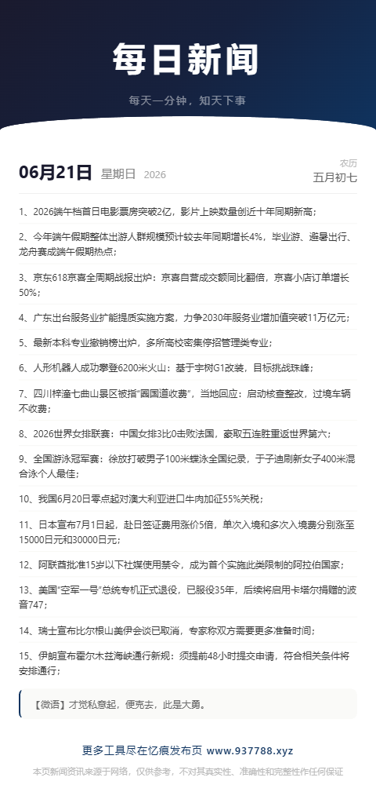

# 每日新闻

每天一分钟，知天下事。一个简洁的每日新闻阅读页面。

演示地址：https://60snews.937788.xyz/

## 功能

- 每日新闻阅读，包含日期（公历/农历）、新闻列表、每日微语
- 字体大小切换（小/中/大三档）
- 一键保存为图片

## 技术栈

- Vue 2.1.8
- jQuery 1.10.2
- html2canvas 1.4.1

## 项目结构

```
├── index.html          # 入口页面
├── css/
│   └── style.css       # 样式文件
└── js/
    ├── app.js          # 应用逻辑
    └── vendor/         # 第三方库（已本地化）
        ├── vue.min.js
        ├── jquery.min.js
        └── html2canvas.min.js
```

## 新闻来源

新闻数据来源为远程 API，打开页面自动获取当日最新内容。

## 截图

